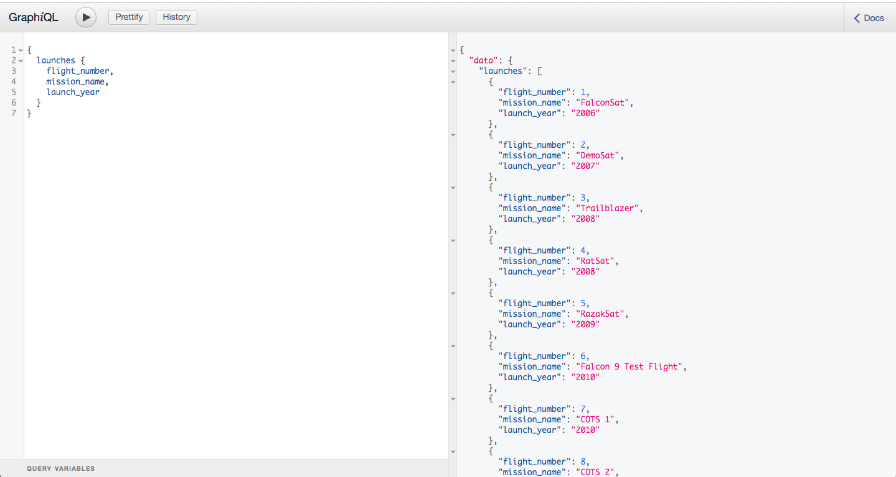
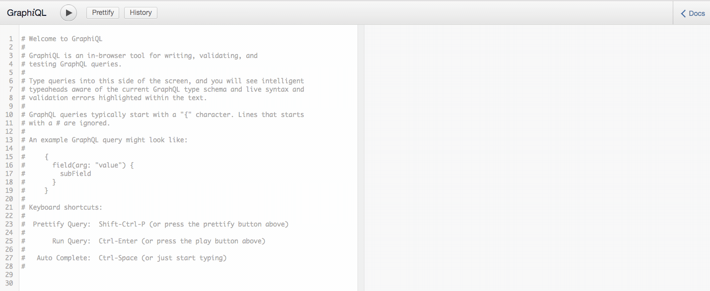

# GraphQL React Application

## Description :clipboard:
:bar_chart: A demo app for using GraphQl with React and Spacex API

1. We set up our server in node for backend ( `localhost:5000/graphql` );
2. We 

## GraphiQL :black_square_button:

## GraphiQL DEMO :video_camera:

## Installation

1. Clone this repo by running `git clone https://github.com/imranhsayed/graphql-react-app`
2. `npm install`
3. `npm run server`

## Useful Links :link:

1. [Express GraphQL github link](https://github.com/graphql/express-graphql)
2. [SpaceX-API](https://github.com/r-spacex/SpaceX-API)
3. [SpaceX-Docs](https://docs.spacexdata.com/)
4. [Apollo GraphQL](https://www.apollographql.com/docs/react/) 
Appollo Client is way to use GraphQL to build client applications. It helps you build a UI that fetches data with GraphQL, and can be used with any JavaScript front-end.

## Instructions :point_right:

Graphiql is a tool that we can use as a client to make request to our server.
Graph Ql will be avialable at `localhost:5000/graphql`

## Common Commands :computer:

1. `npm run dev:webpack` runs webpack-dev-server for frontend on port 3000 in watch mode 
2. `npm run server` runs node server for backend on `localhost:5000/graphql`
3. `npm run dev` would run both front end and backend servers on their respective ports, using concurrently
4. `start` Runs the server at `localhost:5000/graphql` in non watch mode
