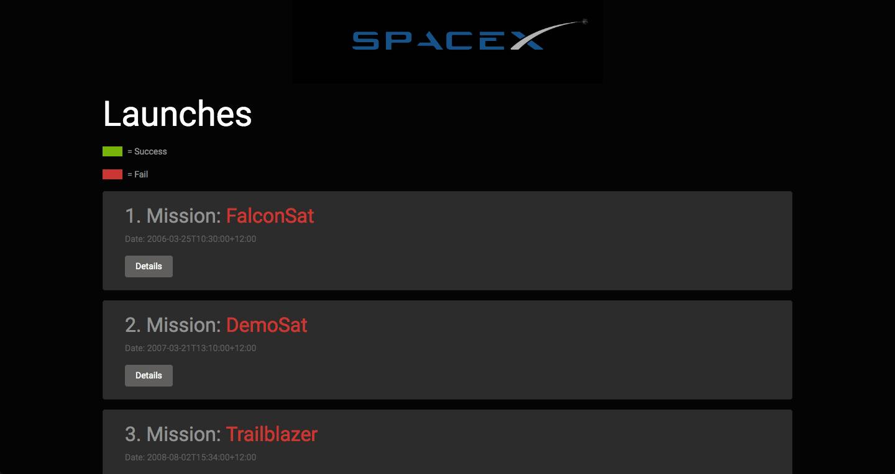

# GraphQL React Application

## Description :clipboard:
:bar_chart: A demo app for using GraphQl with React and SpaceX API

1. :arrow_right: We set up our server in node with express app for backend ( `localhost:5000/graphql` ) : server.js
2. :arrow_right: We set up our react application usin webpack and babel ( that runs webpack-dev-server for frontend on `localhost:3000` )
3. :arrow_right: We create schema and graphQl queries in `schema.js`
4. :arrow_right: We use axios to fetch data from SpaceX API inside the created queries. ( e.g. API URL: `https://api.spacexdata.com/v3/launches` )
5. :arrow_right: GraphiQL playground is available on `localhost:5000/graphql`. Check demo.
6. :arrow_right: We use Appolo Client to build UI in React that fetches data from GraphQL
7. :arrow_right: Created components and wrapped them inside `<AppoloProvider>` and passed appolo `client` to these components.
8. :arrow_right: Created Routes for home and individual pages using Reach router.
9. :arrow_right: Installed `graphql-tag` ( graphQl query parsing utility ) and import `gpl` from it, that parses GraphQL query strings into the standard GraphQL AST.
10. :arrow_right: Use `gpl` to query the data in front react app, from the schema we have create in our node application in backend.
11. :arrow_right: Display all the data received as the reponse of the query.
12. :arrow_right: Also query data by Id when user request for a particular launch item, on a separate page ( e.g. request on url `http://localhost:8080/launch/1` )

## GraphQL App DEMO :video_camera:

## GraphiQL Playground :black_square_button:

## GraphiQL Playground DEMO :video_camera:

## Installation

1. Clone this repo by running `git clone https://github.com/imranhsayed/graphql-react-app`
2. `npm install`
3. `npm run server`

## Useful Links :link:

1. [Express GraphQL github link](https://github.com/graphql/express-graphql)
2. [SpaceX-API](https://github.com/r-spacex/SpaceX-API)
3. [SpaceX-Docs](https://docs.spacexdata.com/)
4. [Apollo GraphQL](https://www.apollographql.com/docs/react/) 
Appollo Client is way to use GraphQL to build client applications. It helps you build a UI that fetches data with GraphQL, and can be used with any JavaScript front-end.

## Instructions :point_right:

Graphiql is a tool that we can use as a client to make request to our server.
Graph Ql will be avialable at `localhost:5000/graphql`

## Common Commands :computer:

1. `npm run dev:webpack` runs webpack-dev-server for frontend on port 8080 in watch mode 
2. `npm run server` runs node server for backend on `localhost:5000/graphql`
3. `npm run dev` would run both front end and backend servers on their respective ports, using concurrently
4. `start` Runs the server at `localhost:5000/graphql` in non watch mode
